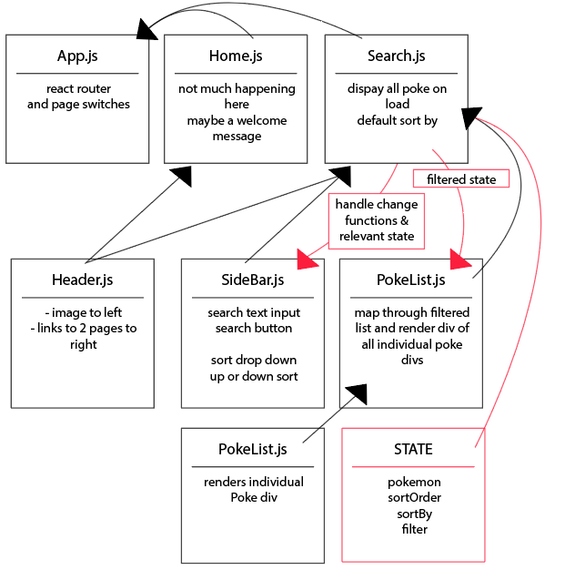

## Plan for React PokeDex

Plan of attack: 

Set up: 
X-HomePage.js
X-SearchPage.js
X-Header.js
X-SideBar.js
X-PokeList,js
X-PokeItem.js

X Link main pages to App.js
X Style and Set up header
X Style and set up side bar
X Feed Poke Items dummy data to get page rendering correctly
X Style poke items and list 
X set initial state and import data.js
X replace dummy datat on page with full data
get sort working by name by default
get other sorts working
    -type 
    -attack
    -defense
get category up/down change working
get keyword search working 